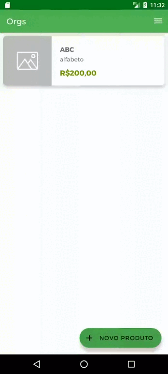
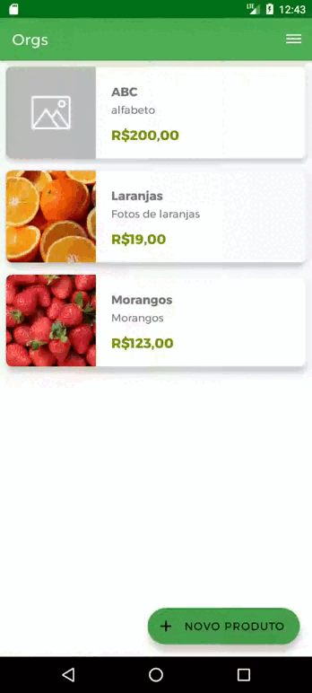
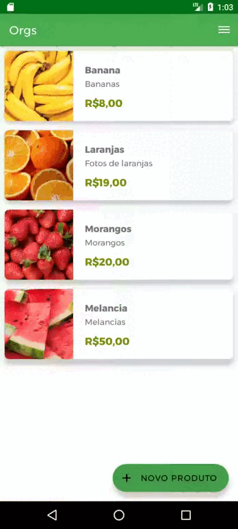
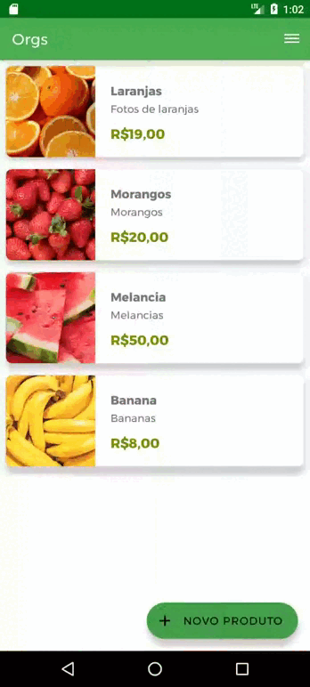

# Orgs - App Android
App Android de simulação de um e-commerce de produtos naturais.

## 🔨 Funcionalidades do projeto

O projeto permite cadastrar, alterar e remover produtos com imagem, nome, descrição e valor. Os produtos salvos são apresentados em uma lista e podem ser visualizados ao realizar o clique.

- Inserindo

- Alterando

- Removendo

## 🎯 Menus

### Menu de popup

Menu de popup ao clicar e pressionar um item da lista de produtos.

### Ordenação de produtos

Menus de opções para ordenar produtos por nome, descrição ou valor.

## ✔️ Técnicas e tecnologias utilizadas

- `Jetpack Room`: lib para persistência de dados em banco de dados interno com SQLite
- `Entidade`: definição da tabela que será criada no banco de dados
- `DAO`: definição dos comportamentos com o banco de dados
    - **comportamentos definidos**: inserção, alteração, remoção e consultas de todos os registros e com filtro
- `Database`: configuração para criar a conexão com o banco de dados
- `conversor de tipo`: converter um tipo complexo para um tipo compatível com o SQLite
- `Menu de opções`: menu para editar e remover
- `Extras`: técnica para enviar e receber informações entre Activities
- `inicialização lateinit e lazy`: técnicas para criar propriedades em Activities que não podem ser inicializadas na construção da Activity
- `Coroutines`: Estrutura para escrever código assíncrono de forma concisa e legível em Kotlin, evitando bloqueios de thread

## 🛠️ Abrir e rodar o projeto

Após baixar o projeto, você pode abrir com o Android Studio. Para isso, na tela de launcher clique em:

Open an Existing Project (ou alguma opção similar)
Procure o local onde o projeto está e o selecione (Caso o projeto seja baixado via zip, é necessário extraí-lo antes de procurá-lo)
Por fim clique em OK
O Android Studio deve executar algumas tasks do Gradle para configurar o projeto, aguarde até finalizar. Ao finalizar as tasks, você pode executar o App 🏆

## 🤝 Contribuições
* Contribuições são bem-vindas! Sinta-se à vontade para abrir problemas, propor melhorias ou enviar solicitações de pull.

⭐️ Star o projeto

🐛 Encontrar e relatar issues